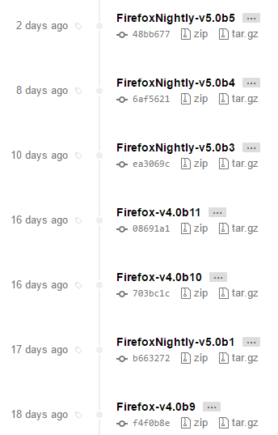

## firefox-ios - Class Project

Stage 0:

1. Project name: 
  - firefox-ios - firefox browser for ios
  - [firefox-ios Repository](https://github.com/mozilla/firefox-ios)
2. Team members:
    - [Rawi Sakhnini](https://github.com/rawisa)
    - [Marian Raad](https://github.com/marianera)
	

## Introduction

Firefox for iOS is a browser from Mozilla, for the Apple iPhone, iPad and iPod touch mobile devices.
It is the first Firefox branded browser to not use the Gecko layout engine as is used in Firefox for desktop and mobile. Due to Apple's application review policies, Firefox uses the built-in iOS WebKit-based rendering framework instead of Gecko.
Firefox for iOS supports Firefox Sync and is able to sync Firefox's browsing history, bookmarks, and recent tabs.

**A general browser architecture:**

**Firefox** architecture looks as the following figure, but because of Apple policies they had to use the build-in ios WebKit instead of gecko.

Firefox is an open-source browser, users around the world help to improve it.
Contributers can communicate through: 
* IRC:            [#mobile](https://wiki.mozilla.org/IRC) for general discussion and [#mobistatus](https://wiki.mozilla.org/IRC) for team status updates.
* Mailing list:   [mobile-firefox-dev@mozilla.org](https://mail.mozilla.org/listinfo/mobile-firefox-dev).

They can find the bugs that need to be fixed at the following list:

* Bugs:           [File a new bug](https://bugzilla.mozilla.org/enter_bug.cgi?bug_file_loc=http%3A%2F%2F&bug_ignored=0&op_sys=iOS%20&product=Firefox%20for%20iOS&rep_platform=All) • [Existing bugs](https://bugzilla.mozilla.org/describecomponents.cgi?product=Firefox%20for%20iOS) 

# Statics

**The weekly commits:**

**Notice the high code change frequency:**

Looking at the following release frequency, one can understand that firefox uses the agile method.
Also according to [itbusinessedge](http://www.itbusinessedge.com/cm/blogs/all/mozilla-takes-hybrid-approach-to-agile-software-development/?cs=38988):
"Mozilla has also begun using a hybrid model that incorporates elements of both agile and waterfall approaches for its flagship Firefox Web browser. The goal is to more quickly introduce new features -- aided by agile's emphasis on iterative releases -- while maintaining backward compatibility, security and overall code quality.".

Firefox has bugs/features list in their [issues](https://github.com/mozilla/firefox-ios/issues) in github:

## Contributor guidelines

### Creating a pull request
* All pull requests must be associated with a specific bug in [Bugzilla](https://bugzilla.mozilla.org/).
 * If a bug corresponding to the fix does not yet exist, please [file it](https://bugzilla.mozilla.org/enter_bug.cgi?op_sys=iOS&product=Firefox%20for%20iOS&rep_platform=All).
 * You'll need to be logged in to create/update bugs, but note that Bugzilla allows you to sign in with your GitHub account.
* Use the bug number/title as the name of pull request. For example, a pull request for [bug 1135920](https://bugzilla.mozilla.org/show_bug.cgi?id=1135920) would be titled "Bug 1135920 - Create a top sites panel".
* Finally, upload an attachment to the bug pointing to the GitHub pull request.
 1. Click <b>Add an attachment</b>.
 2. Next to <b>File</b>, click <b>Paste text as attachment</b>.
 3. Paste the URL of the GitHub pull request.
 4. Enter "Pull request" as the description.
 5. Finally, flag the pull request for review. Set the <b>review</b> field to "?", then enter the name of the person you'd like to review your patch. If you don't know whom to add as the reviewer, click <b>suggested reviewers</b> and select a name from the dropdown list.

<b>Pro tip: To simplify the attachment step, install the [Github Bugzilla Tweaks](https://github.com/autonome/Github-Bugzilla-Tweaks) addon. This will add a button that takes care of the first four attachment steps for you.</b>

### Swift style
* Swift code should generally follow the conventions listed at https://github.com/raywenderlich/swift-style-guide.
  * Exception: we use 4-space indentation instead of 2.

### Whitespace
* New code should not contain any trailing whitespace.
* We recommend enabling both the "Automatically trim trailing whitespace" and "Including whitespace-only lines" preferences in Xcode (under Text Editing).
* <code>git rebase --whitespace=fix</code> can also be used to remove whitespace from your commits before issuing a pull request.

### Commits
* Each commit should have a single clear purpose. If a commit contains multiple unrelated changes, those changes should be split into separate commits.
* If a commit requires another commit to build properly, those commits should be squashed.
* Follow-up commits for any review comments should be squashed. Do not include "Fixed PR comments", merge commits, or other "temporary" commits in pull requests.

